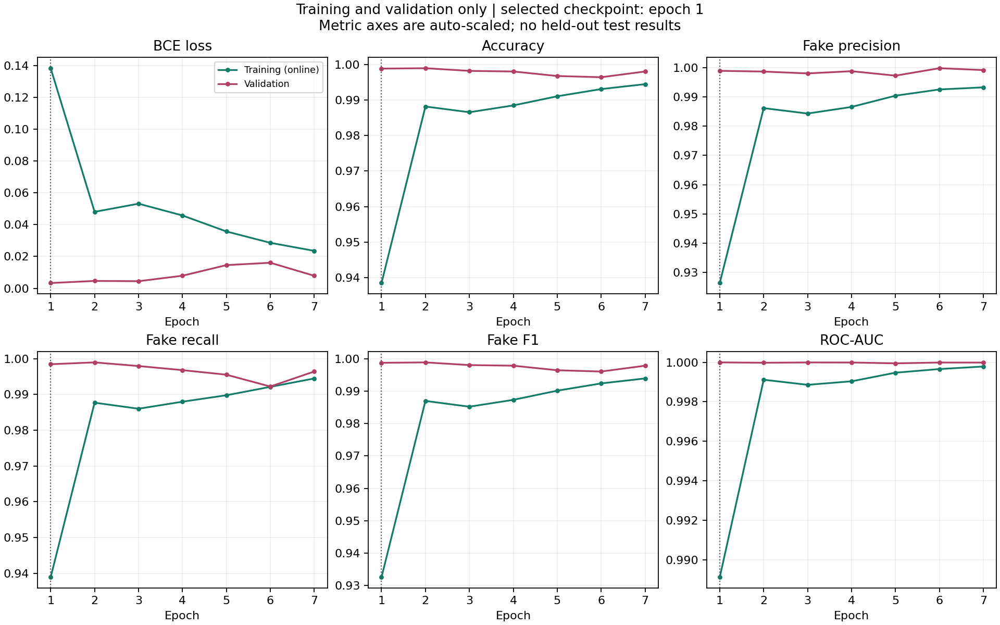
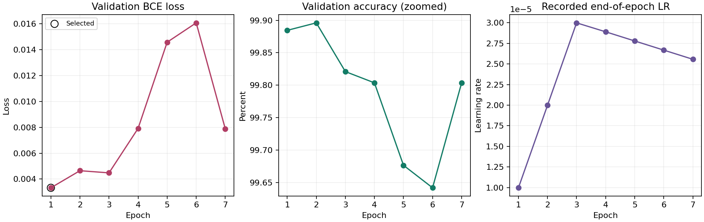
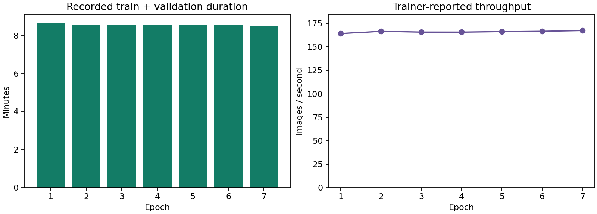

# ViT-B/16 Training Evidence Report

Run: `vit_wish_s42_ddp2_v1`  
Scope: recorded training, validation and Gradio validation-subset checks.  
Format: model-card-style experiment report. No proprietary OpenCodeGen format is claimed.

## 1. Executive Summary

The exported run completed **7 epochs** of a maximum 30. The checkpoint selected by minimum validation loss is **epoch 1**, not epoch 7. Its recorded validation accuracy is **99.8845%**, fake-class F1 is **0.998725**, and ROC-AUC is **0.99999348**. The epoch 1 checkpoint and this report refer to the same SHA-256-verified weight file already stored in the project repository.

Training plus validation calls account for **3598.03 seconds**, approximately **59 minutes 58 seconds**. Six consecutive later epochs did not improve validation loss. Together with the supplied stopping code and patience 6, this explains the stop at epoch 7. The completion file records status `trained` but does not itself name a stop reason; early stopping is inferred from the corroborating evidence.

The Gradio summary reports correct labels for **36/36 validation examples**, plus agreement between direct inference and both endpoints. **No final primary-test or cross-generator results are included.** Strong validation performance is not proof of unseen-generator robustness or superiority over the team's CNNs.

## 2. Model and Intended Use

Plain ViT-B/16 with 16x16 patches, a single-logit binary head, dropout 0.1 and **85,799,425 trainable parameters**. The named timm checkpoint is `vit_base_patch16_224.augreg_in21k_ft_in1k`: ImageNet-21k pretraining followed by ImageNet-1k fine-tuning before this Wish run. The optional FFT branch is disabled.

Inference uses RGB input, square 224x224 bicubic resizing, and mean/std **[0.5, 0.5, 0.5]**. Real is 0; fake is 1. A fake probability of at least 0.5 predicts fake. These are model scores, not calibrated assurances of authenticity. Intended inputs are face crops resembling the training data; arbitrary photos, face swaps and other generators are outside the demonstrated evidence.

## 3. Data and Provenance

Dataset: `wish096/realvsfake-81k-by-wish`. The supplied code defines train/validation/primary testing using FFHQ and CelebA real faces plus StyleGAN fakes. Stable Diffusion and separate real controls are reserved for cross-generator testing; AiGenImage is excluded. These are **code-level protocol statements**, not independently verified split membership in this report.

The export does not contain the manifest, audit, image inventory or dataset images. Exact split sizes, source proportions, duplicate exclusions, identity overlap and leakage status therefore cannot be independently verified. A recorded checksum identifies an expected manifest; it does not substitute for inspecting that manifest.

Manifest SHA-256 recorded in checkpoint:  
`2c0a6ff549eab6568ff35552d08c47a7a00eb0bd8e2bb82e1775a946056f1492`

Dataset snapshot recorded in checkpoint:  
`content-sha256:89612e195edc71ace7cc953d87e9184b4e31609dd24915d2625ab548b6fced9e`

## 4. Training Protocol

| Setting | Recorded value |
| --- | --- |
| Seed | 42 |
| Optimizer / loss | AdamW / BCEWithLogitsLoss |
| Target learning rate / weight decay | 0.00003 / 0.01 |
| Schedule | 10% linear warmup, then linear decay |
| Gradient clipping | 1.0 |
| Distributed workers | 2 CUDA ranks |
| Per-GPU microbatch / effective batch | 16 / 32 |
| Accumulation steps | 1 |
| Mixed precision | Enabled |
| Maximum epochs / patience | 30 / 6 |
| Selection criterion | Lowest validation loss |

The notebook is intended for T4 x2, but the export lacks an environment/device log, so the exact GPU SKU and dependency versions used during training are not independently verified. The supplied training implementation uses a padding DistributedSampler for training and removes repeated sample IDs from reported metrics. Depending on sample-count divisibility, padding can still repeat training examples in gradient updates. The absent manifest prevents checking whether this occurred. Validation uses disjoint, unpadded shards.

## 5. Recorded Results

All metrics below are **validation** metrics. Classification scores use a 0-1 scale, MCC uses -1 to 1, and BCE loss is nonnegative without an upper bound. They are read from the epoch history, not recomputed from missing per-image predictions. Precision, recall and F1 treat fake as the positive class. AP means average precision, not trapezoidal PR-AUC.

| Metric | Selected checkpoint: epoch 1 | Last recorded epoch: 7 |
| --- | ---: | ---: |
| BCE loss | 0.00332263 | 0.00788383 |
| Accuracy | 0.99884507 | 0.99803661 |
| Fake precision | 0.99898011 | 0.99923332 |
| Fake recall | 0.99847095 | 0.99643221 |
| Fake F1 | 0.99872547 | 0.99783080 |
| ROC-AUC | 0.99999348 | 0.99998528 |
| Average precision | 0.99999217 | 0.99998243 |
| Balanced accuracy | 0.99881304 | 0.99789928 |
| Real specificity | 0.99915514 | 0.99936635 |
| MCC | 0.99766972 | 0.99604083 |

Epoch 2 has the highest recorded validation accuracy, but its validation loss is worse than epoch 1. It is therefore **not** the checkpoint selected by the declared protocol. Changing selection criteria after observing results would describe a different experiment.

| Epoch | Training BCE | Validation BCE | Validation accuracy | Validation F1 |
| --- | ---: | ---: | ---: | ---: |
| 1 | 0.138305 | 0.003323 | 99.8845% | 0.998725 |
| 2 | 0.048048 | 0.004645 | 99.8961% | 0.998853 |
| 3 | 0.053184 | 0.004477 | 99.8210% | 0.998025 |
| 4 | 0.045777 | 0.007914 | 99.8037% | 0.997832 |
| 5 | 0.035733 | 0.014584 | 99.6766% | 0.996429 |
| 6 | 0.028595 | 0.016080 | 99.6420% | 0.996035 |
| 7 | 0.023548 | 0.007884 | 99.8037% | 0.997831 |

Training metrics summarize augmented batches while model weights are changing; they are not a fixed-checkpoint evaluation of the entire training set. Metric axes in this figure are auto-scaled and do not all start at zero.

## 6. Convergence and Checkpoint Selection

Training loss falls from 0.138305 to 0.023548, while validation loss is best at the first epoch and remains worse in all six later epochs. The final validation loss is approximately 2.37 times the best value. This supports retaining the early checkpoint rather than assuming the latest weights are better.

The target learning rate is approached around epoch 3 during warmup. Subsequent worsening validation loss may reflect increased confidence on mistakes, optimization sensitivity or overfitting to the training domain. Aggregate curves cannot establish which explanation is correct, and they do not prove leakage. Strong pretraining and training-only augmentation/dropout can also help explain validation performance exceeding the online training metrics.

Further tuning, if justified, must use validation only and retain a fresh final test protocol. Do not extend training merely to reach 30 epochs or select the most flattering metric after the fact.

## 7. Efficiency

Recorded train/validation time: **3598.03 seconds**. Mean recorded epoch duration: **8.57 minutes**. Mean reported training throughput: **166.15 images/second** across the run's distributed training process.

These timings exclude dataset audit/cache preparation, setup and most output writing. The trainer's throughput is not a controlled synchronized inference benchmark. There is no matched single-GPU baseline, so neither a twofold speedup nor a total end-to-end runtime improvement can be claimed. Inference latency and peak GPU memory are unreported.

## 8. Gradio Integration Evidence

The supplied summary reports **24 real and 12 fake validation images**, all predicted correctly. Sources are CelebA, FFHQ and StyleGAN. Both single-image and batch endpoints reportedly match direct model inference. The summary records Gradio 5.50.0 for this self-test.

This is a small selected subset already involved in model selection. **100% on these 36 examples is not final detector accuracy.** The export omits the per-image self-test CSV and example identities, so the summary cannot be independently regenerated. No Stable Diffusion examples were part of this reported self-test. No confusion matrix or uncertainty interval for the full validation/test population is invented from this summary.

## 9. Evaluation Gaps and Limitations

| Evidence | Availability |
| --- | --- |
| Training history and best weights | Supplied and internally reconciled |
| Primary held-out test | Not completed according to supplied self-test summary; no results supplied |
| Cross-generator test | Not completed according to supplied self-test summary; no results supplied |
| Accuracy/F1 generalization drops | Not calculable |
| Per-image probabilities and confusion counts | Not supplied |
| ROC/PR curve points and calibration | Not supplied; cannot reconstruct from scalar AUC/AP |
| Shared-split four-model comparison | Not supplied |
| Repeated-seed uncertainty | One seed only |
| Dataset/identity leakage verification | Manifest, audit and identity evidence absent |
| Exact hardware and training package versions | Environment log absent |

Source/compression shortcuts, unequal pretraining, unknown identity overlap and changes in image generator can all limit external validity. The defensible conclusion is excellent **recorded within-dataset validation** performance, not a universal deepfake detector.

## 10. Reproducibility and Next Evidence

The checkpoint SHA-256 is `be78ec4969aaf73dc82918f6c9aa794e6d196287920d1957c511106f458a452c`. The supplied Python runtime reproduces configuration hash `186a54138fb432ec11601d2d7cd82b65bbd2fa52e180bb35983f63d016fae0d4`. The JSON includes source-file hashes, the complete seven-epoch history, metric definitions and consistency checks. No training, test inference or checkpoint modification was performed to create this report.

Retrieve the exact manifest/audit and complete run environment. Freeze the selected checkpoint and threshold, then perform the agreed primary and cross-generator evaluations without tuning on either test. Export per-image predictions, confusion matrices, ROC/PR curves, calibration diagnostics, false positives/negatives and synchronized inference timing. Compare A/B models only after verifying compatible training and held-out assignments. Keep missing results explicitly unavailable until these measurements exist.

Evidence inputs: `training_history.csv`, `training_complete.json`, `run_config_used.json`, `best_model.pt`, `gradio_app/self_test_summary.json`, and supplied runtime source. Original lightweight inputs are preserved in `evidence/`; the large checkpoint is identified by its hash rather than duplicated.
